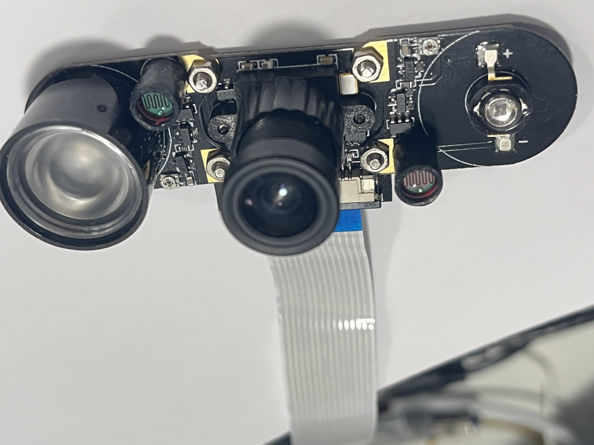
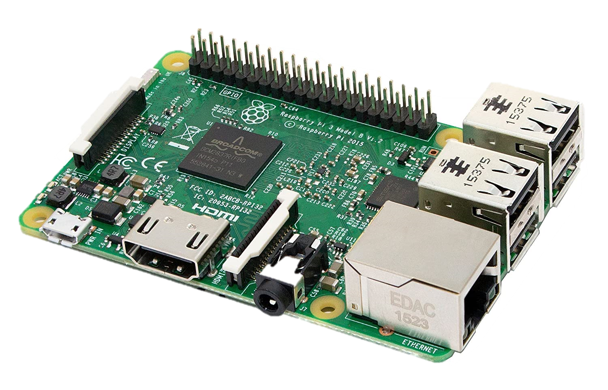

<div align="center">

</div>
<h1 align="center">Fatigue_detecting</h1>

<div align="center">
  

[](https://github.com/FatigueDetecting/Fatigue_detecting/blob/main/LICENSE)
[](https://github.com/RichardLitt/standard-readme)

[](https://twitter.com/dengmin17290037)

</div>
<div align="center">
  


  
</div>
  <p align="center">
    <a href="https://github.com/FatigueDetecting/Fatigue_detecting/wiki"><strong>View Demo    </strong></a>
    <a href="https://github.com/FatigueDetecting/Fatigue_detecting/wiki"><strong>View Viki    </strong></a>
    </br> 
    <a href="https://github.com/FatigueDetecting/Fatigue_detecting/issues">Report Bug</a>
    <a href="https://github.com/FatigueDetecting/Fatigue_detecting/issues">Request Feature</a>
</p>
  
## Table of Contents

- [Background](#background)
- [Hardware](#hardware)
- [Install](#install)
- [Usage](#usage)
- [API](#api)
- [Contributors](#contributors)
- [License](#license)


## Background

The increasing number of traffic accidents and the casualties and property losses caused by them have gradually become a common concern of the society.  
How to detect the fatigue state of drivers efficiently and accurately is of great social significance to effectively protect the life and property safety of drivers and other related personnel.
<div align="center">

</div>

This project uses night vision cameras to monitor the driver's status in real time. The system recognises and alerts the driver when they are yawning, nodding and blinking frequently.

## Hardware
  
 <div align="center">
 OV5647
 RaspberryPi 4B
</div>
  
## Software

- [Opencv 4.5.1](https://opencv.org/opencv-4-5-1/)
- [Dlib](http://dlib.net/)
- [Qt creator](https://www.qt.io/product/development-tools)
- [libfacedetection](https://github.com/ShiqiYu/libfacedetection)
  
## Install

1. Clone this repository
```
git clone https://github.com/FatigueDetecting/Fatigue_detecting.git
```
2. Install Dependency 
```

```
3. Build
```

```
4. Run
```

```

```
```


## Usage


## Contributors
- [Rui Sun(2664218S)](https://github.com/SR9898)
- [Yenuo Liu(2706420L)](https://github.com/pateral)
- [Ming Deng(2675614D)](https://github.com/MingDengEason)
- [Ruixian Hong(2646699H)](https://github.com/smallssnow)


## License

[MIT © Richard McRichface.](../LICENSE)


